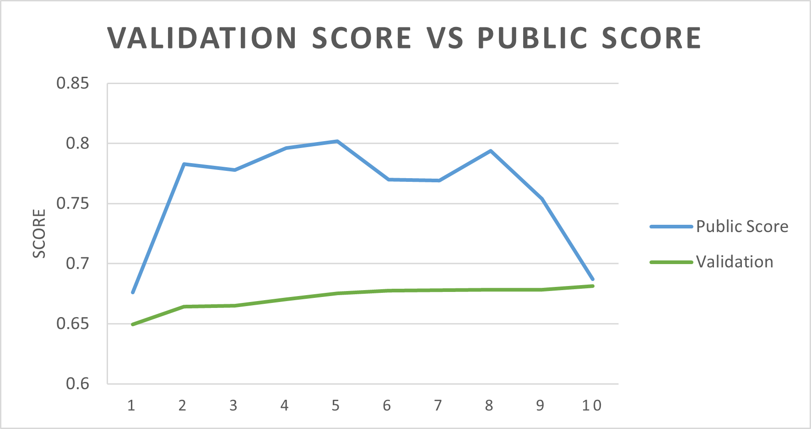

# Kaggle-Jigsaw-Rate-Severity-of-Toxic-Comments

## **Goal**
To rank the relative ratings of toxicity between comments from the Wikipedia Talk page

## **Outcome**
Reached 0.802/1.000 public score on Kaggle

## **Dataset**
### Training data:
 
|id|comment_text|toxic|severe_toxic|obscene|threat|insult|identity_hate|
|---|---|---|---|---|---|---|---|
|0000997932d777bf|Explanation\nWhy the edits made under my usern..|    0|1|0|0|0|0|
|000103f0d9cfb60f|D'aww! He matches this background colour I'm s..|    0|0|0|1|1|0|
|000113f07ec002fd|Hey man, I'm really not trying to edit war. It..|    1|0|0|0|1|1|
|0001b41b1c6bb37e|"\nMore\nI can't make any real suggestions on ..|    0|1|1|0|0|0|
|0001d958c54c6e35|You, sir, are my hero. Any chance you remember...|0|0|0|1|0|0|

**id** : unique id of each comment  
**comment_text** : comment text crawled from Wikipedia Talk page  
**toxic**, **severe_toxic**, **obscene**, **obscene**, **threat**, **insult**, **identity_hate** : labels generated from previous competition that match the column description 

### Validation data:  
Pair of comments where experts have marked one to be more toxic than the other.

|worker|less_toxic|more_toxic|
|---|---|---|
|313|This article sucks \n\nwoo woo wooooooo|WHAT!!!!!!!!?!?!!?!?!!?!?!?!?!!!!!!!!!!!!!!!!!...|
|188|"And yes, people should recognize that but the...|Daphne Guinness \n\nTop of the mornin' my fav...|
|82|Western Media?\n\nYup, because every crime in...|"Atom you don't believe actual photos of mastu...|
|347|And you removed it! You numbskull! I don't car...|You seem to have sand in your vagina.\n\nMight...|
|539|smelly vagina \n\nBluerasberry why don't you ...|hey \n\nway to support nazis, you racist|

### Testing data:
Raw text to be predicted the toxicity ranking

|comment_id|text|
|---|---|
|114890|"\n \n\nGjalexei, you asked about whether ther...|
|732895|Looks like be have an abuser , can you please ...|
|1139051|I confess to having complete (and apparently b...|
|1434512|"\n\nFreud's ideas are certainly much discusse...|
|2084821|It is not just you. This is a laundry list of ...|

## Method
- Data Pre-processing:
  - Calculate weightings
    - We want to generate a singular **y** value for use in a regression model, so we give weights to each tag column and sum up their values to create a final *"level"* field.
    - Weights were chosen after trial and error, with the final weights being obtained from a trained model of a previous competition.
  - Tokenization
  - Lemmatization
  - Data Cleaning
    - Remove internal Wiki links, signatures and time stamps
    - Remove URLs
    - Replace common profanity filter evasion words with their corresponding words
    - Replace repetitive characters 
  
- Adding Features:
  - Punctuation percentage
  - Uppercase percentage
  - Average sentence length
  - Profanity Words percentage
  - Total comment length

- Encoding:
    - Tf-Idf Vectorizer + generated features

- Model Selection:
  - Linear Regression
  - Linear Supported Vector Regression (Linear SVR)
  - Ridge Regression
  - Random Forest Regression

## Discussion
(1) Higher Score Predicted by Validation Data Does not Guarantee Higher Public Score Predicted on Testing Data
 - The best score achieved for the validation data is 0.68 while its public score is 0.687, being almost the lowest public score.
 - The calculated correlation between the two scores is 0.328.
 - Possible reason of the low correlation could be, the public score calculates the similarity of ranking of the predicted scores, while the validation score represents pair-wise comparison accuracy.
 - All datasets involve some form of subjective scoring.

(2) Comparing the Models Being Used:
- Linear Regression: 
    - Used for most of the testing at the beginning since its calculation is quick and robust enough.
    - Switched to more advanced models after finding those that are suitable
- Supported Vector Regression(SVR):
    - Due to the large amount of variables, SVR takes a long time to process, making it not the most ideal model for testing.
    - The outcome usually slightly better than using linear regression.
- Linear SVR:
    - Substitute for the SVR method, since it is faster and the result is similar.
- Ridge Model: 
    - More stable comparing to Linear SVR.

(3) Why Not Using Bert?
- Most of the top ranking teams on the leaderboard use Bert as one of their blending methods. However, Bert requires better hardware specs to run smoothly. Aiming to train a model that is more generalized and not confined to hardware limitations, I decided not to use Bert during the model selection process.

## Other Information
Kaggle Competition Overview:
https://www.kaggle.com/c/jigsaw-toxic-severity-rating/overview